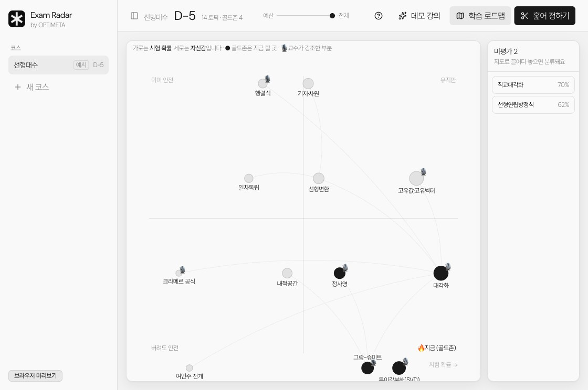
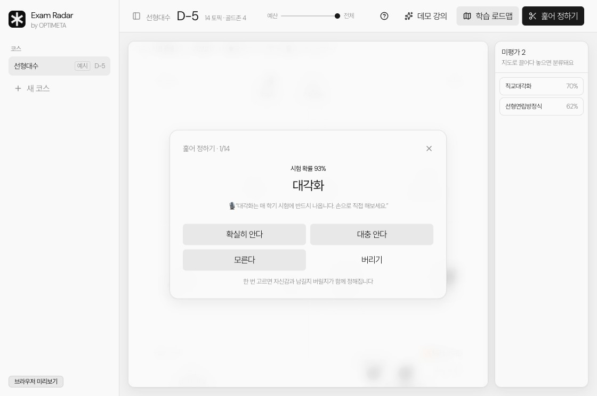
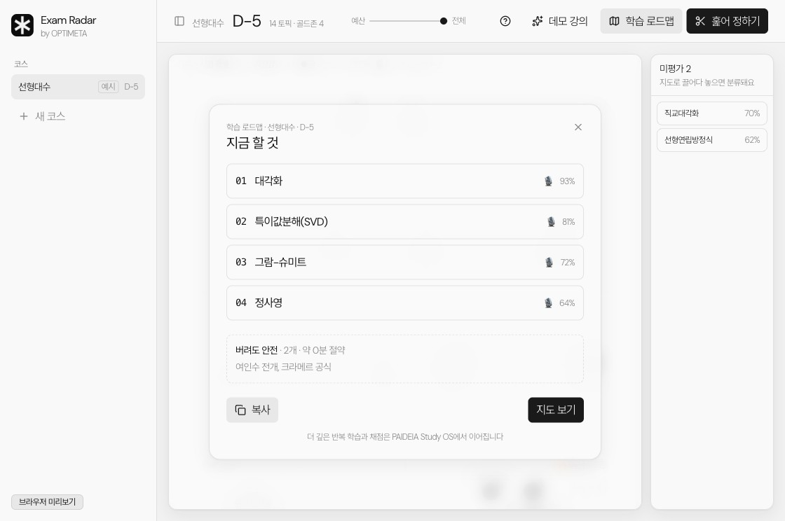
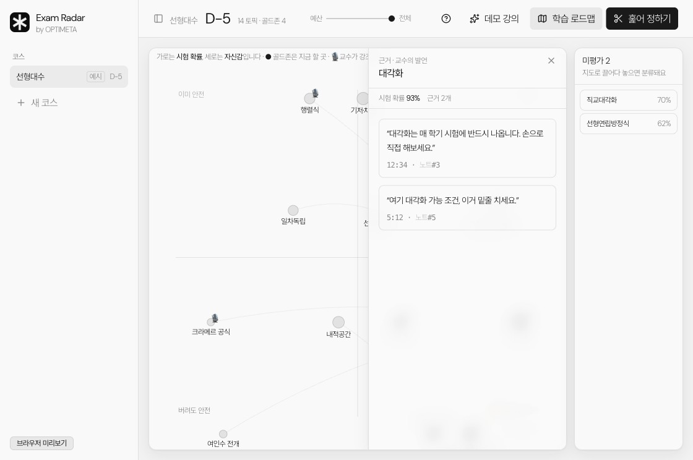
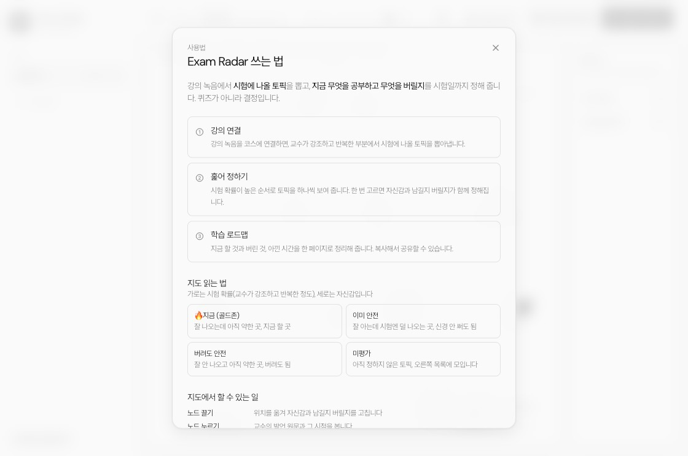

<p align="center">
  
</p>

<h1 align="center">Exam Radar · 시험 레이더</h1>

<p align="center">
  <strong>공부는 적게, 점수는 높게.</strong><br>
  <em>강의 녹음에서 무엇을 공부하고 무엇을 버릴지 시험일까지 정해 주는 도구입니다. 강의가 쌓일수록 함께 자라나는 2차원 결정 지도이며, 문제를 더 만들어 주는 퀴즈 도구가 아니라 결정을 도와주는 도구입니다.</em>
</p>

<p align="center">
  
  
  
  
  
  
  
  
  
</p>

<p align="center">
  <a href="https://github.com/OPTIMETA/PAIDEIA"><strong>PAIDEIA</strong> 첫 번째 제품 (Claude Code)</a>
  &nbsp;·&nbsp;
  <a href="https://github.com/OPTIMETA/PAIDEIA-codex"><strong>PAIDEIA-codex</strong> (Codex)</a>
  &nbsp;·&nbsp;
  <a href="https://taewoopark.com">taewoopark.com</a>
</p>

> **Exam Radar는 OPTIMETA의 철학을 담은 두 번째 제품입니다.** OPTIMETA의 첫 번째 제품은 한 과목을 시험일까지 깊이 끌고 가는 **[PAIDEIA](https://github.com/OPTIMETA/PAIDEIA)**(Claude Code 플러그인)와 **[PAIDEIA-codex](https://github.com/OPTIMETA/PAIDEIA-codex)**(Codex 버전)입니다. Exam Radar는 같은 철학, 곧 *공부는 적게, 점수는 높게*를 Alt 위에서 "결정"이라는 한 가지로 풀어냅니다.

<p align="center">
  <em>교수가 세 시간을 이야기해도, 시험에 나올 신호는 그중 삼십 분에 몰려 있습니다.<br>
  Exam Radar는 그 삼십 분을 찾아 주고, 나머지 두 시간 반은 버려도 된다고 말해 줍니다.</em>
</p>

<p align="center">
  
</p>

---

## 왜 결정인가

레이더는 모든 것을 똑같이 그리지 않습니다. 신호와 잡음을 갈라내고, 다가오는 것만 밝게 띄웁니다. Exam Radar가 시험 준비에서 하는 일이 바로 그것입니다.

대부분의 학습 도구는 공부할 거리를 늘립니다. 문제를 더 만들고 요약을 더 뽑아내면서, 결국 봐야 할 양이 점점 많아집니다. Exam Radar는 반대로 갑니다. 공부할 양 자체를 줄여 줍니다.

```
강의 녹음  →  시험 신호 추출  →  2차원 결정 지도  →  훑어 정하기  →  학습 로드맵
```

강의가 쌓일수록 지도는 점점 더 자랍니다. 각 단계가 내놓는 것은 더 많은 공부거리가 아니라 하나의 결정입니다. 지금은 이것을 하고, 저것은 버려라.

---

## 퀴즈 생성기가 하지 못하는 일

퀴즈 생성기나 일반 학습 도구는 당신의 시험에 맞춰 무엇을 버릴지 골라 주지 못합니다. 그들이 파는 것이 결국 공부할 거리를 늘리는 일이기 때문입니다. 공부량을 줄여 주는 도구는 자기 사업을 부정해야만 만들 수 있습니다.

| 기준 | Exam Radar | 퀴즈 생성기와 일반 학습 도구 |
|------|------------|------------------------------|
| 무엇이 중요한가 | 교수가 강조하고 반복한 정도로 시험 확률을 매깁니다 | 모든 내용을 똑같이 다룹니다 |
| 무엇을 버릴까 | 이건 버려도 괜찮다고 분명히 말해 줍니다 | 말해 주지 못합니다. 오히려 할 일을 늘립니다 |
| 다루는 단위 | 과목 하나를 시험일까지 통째로 관리합니다 | 문서 하나나 한 번의 대화에 그칩니다 |
| 내놓는 것 | 결정입니다. 지금 할 것과 버릴 것, 아낀 시간을 알려 줍니다 | 풀어야 할 문제 더미를 내놓습니다 |
| 시간 제약 | 시험일과 공부 시간 예산에 맞춰 자동으로 추려 줍니다 | 마감이라는 개념이 없습니다 |
| 신호의 출처 | 바로 당신 교수의 그 강의 녹음입니다 | 일반적인 교과서나 강의 계획서입니다 |
| 방향 | 공부할 양을 줄여 줍니다 | 공부할 양을 늘립니다 |

어떤 퀴즈 생성기도 4단원 2절은 건너뛰어도 된다고 말하지 못합니다. Exam Radar가 주는 첫 번째 가치가 바로 그 한마디입니다.

---

## 핵심 원리: 교수의 말이 곧 출제 신호입니다

흔히 똑똑하게 공부하는 법은 약한 부분부터 채우라고 말합니다. 하지만 순서가 거꾸로입니다. 교수는 이미 어디가 시험에 나올지 알려 주었습니다. 강의에서 강조하고, 반복하고, 이건 중요하다고 짚어 준 그 순간들로 말입니다.

Exam Radar는 강의 녹음을 글로 옮긴 기록에서 그 신호를 뽑아내, 한 축이 아니라 두 축으로 펼쳐 봅니다.

- **가로축은 시험 확률입니다.** 교수가 강조하고 반복한 정도로 정해집니다. 강의가 쌓이면서 같은 내용이 세 번째로 반복되면 확률은 더 올라갑니다.
- **세로축은 자신감입니다.** 훑어 정하기에서 당신이 한 번의 선택으로 입력합니다.

이 두 축이 만나 네 칸으로 나뉜 결정표가 됩니다.

---

## 2차원 결정 지도

```
                     ▲ 자신감 높음
                     │
       이미 안전       │       유지만
                     │
  시험 확률 낮음 ◀─────┼─────▶ 시험 확률 높음
                     │
       버려도 안전     │    🔥 지금 (골드존)
                     │
                     ▼ 자신감 낮음
```

| 칸 | 위치 | 어떤 곳인가 | 무엇을 할까 |
|----|------|-------------|-------------|
| 🔥 **지금 (골드존)** | 시험 확률 높고 자신감 낮음 | 잘 나오는데 아직 약한 곳 | **가장 먼저 해야 할 곳입니다** |
| 유지만 | 시험 확률 높고 자신감 높음 | 잘 나오고 이미 아는 곳 | 가볍게 유지만 하면 됩니다 |
| 이미 안전 | 시험 확률 낮고 자신감 높음 | 잘 안 나오는데 이미 아는 곳 | 신경 쓰지 않아도 됩니다 |
| **버려도 안전** | 시험 확률 낮고 자신감 낮음 | 잘 안 나오고 아직 약한 곳 | **버려도 괜찮습니다. 다른 도구는 감히 못 하는 말입니다** |

지도 위에서 동그라미의 크기는 시험 확률을, 놓인 자리는 결정을 뜻합니다. 같은 강의에 함께 나온 토픽끼리는 선으로 이어집니다. 마이크 표시는 교수가 그 토픽을 강조한 대목이 있다는 뜻입니다.

<table>
  <tr>
    <td align="center" width="50%">
      
      <br><sub><b>훑어 정하기</b> · 시험 확률이 높은 순서로 한 장씩 보여 줍니다. 한 번의 선택으로 자신감과 남길지 버릴지를 함께 정합니다.</sub>
    </td>
    <td align="center" width="50%">
      
      <br><sub><b>학습 로드맵</b> · 지금 할 것과 버린 것, 아낀 시간을 한 페이지로 정리해 줍니다.</sub>
    </td>
  </tr>
</table>

---

## 지도에서 할 수 있는 일

기능을 늘리는 대신, 지도라는 하나의 대상에 할 수 있는 동작을 늘렸습니다.

| 동작 | 어디서 | 하는 일 |
|------|--------|---------|
| **강의 연결과 수집** | 새 코스에서 강의 녹음을 연결합니다 | 교수의 말에서 시험에 나올 토픽을 뽑아냅니다 |
| **훑어 정하기** | 훑어 정하기 버튼 | 시험 확률이 높은 순서로 한 장씩, 한 번의 선택으로 자신감과 남길지 버릴지를 정합니다 |
| **학습 로드맵** | 학습 로드맵 버튼 | 지금 할 것과 버린 것, 아낀 시간을 한 페이지로 모아 줍니다. 복사할 수 있습니다 |
| **근거 보기** | 노드 누르기 | 교수의 발언 원문과 그 시점을 보여 줍니다. Alt에서는 원래 노트로 바로 이동합니다 |
| **시간 예산** | 위쪽 막대 | 공부할 수 있는 시간을 정하면, 그 안에 맞게 로드맵을 추려 줍니다 |
| **끌어 옮기기** | 노드 끌기 | 노드를 직접 옮겨 자신감과 남길지 버릴지를 손으로 고칩니다 |

<table>
  <tr>
    <td align="center" width="50%">
      
      <br><sub><b>근거 보기</b> · 노드를 누르면 그 토픽을 두고 교수가 한 말과 시점이 그대로 나옵니다.</sub>
    </td>
    <td align="center" width="50%">
      
      <br><sub><b>사용법</b> · 처음 쓰는 사람도 헷갈리지 않도록 읽는 법과 동작을 한곳에 모았습니다.</sub>
    </td>
  </tr>
</table>

> 예측과 실제를 견주며 학습자에게 더 맞춰 가는 깊은 되먹임은 첫 번째 제품 **PAIDEIA**에 있습니다. Exam Radar는 *무엇을 할지 결정하는* 한 가지에 집중합니다.

---

## 버리는 도구, 자라는 과목

- **버리기.** 교수가 세 시간을 이야기해도 시험 신호는 삼십 분에 몰려 있습니다. 여기에 집중하고 여기는 버려도 된다고 말해 주는 것, 그 버린다는 결정 자체가 핵심 가치입니다.
- **자라기.** 퀴즈 생성기는 문서 한 개를 다룹니다. Exam Radar는 과목 하나를 시험일까지 통째로 관리합니다. 강의가 쌓일수록 이 내용이 벌써 세 번째 반복된다처럼 과목 전체에서 떠오르는 핵심 영역이 함께 자랍니다.

이 둘이 합쳐진 것이 자라나는 2차원 결정 지도입니다. 공부는 적게, 점수는 높게. 이 방향을 그대로 따라 하려면 경쟁자는 자기 제품을 부정해야 하므로, 쉽게 흉내 낼 수 없는 강점이 됩니다.

---

## 더 알아보기

OPTIMETA는 최적화(Optimization)와 메타(Meta)를 합친 이름으로, 노력을 한 단계 위에서 최적화한다는 뜻입니다.

[첫 번째 제품 PAIDEIA](https://github.com/OPTIMETA/PAIDEIA) · [PAIDEIA-codex](https://github.com/OPTIMETA/PAIDEIA-codex) · [taewoopark.com](https://taewoopark.com)

<p align="center"><sub><em>퀴즈를 더 만들지 마세요. 무엇을 공부하고 무엇을 버릴지부터 정하세요.</em></sub></p>
